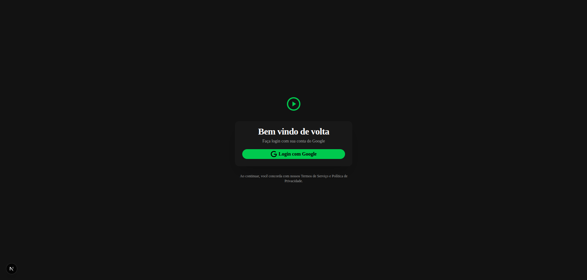
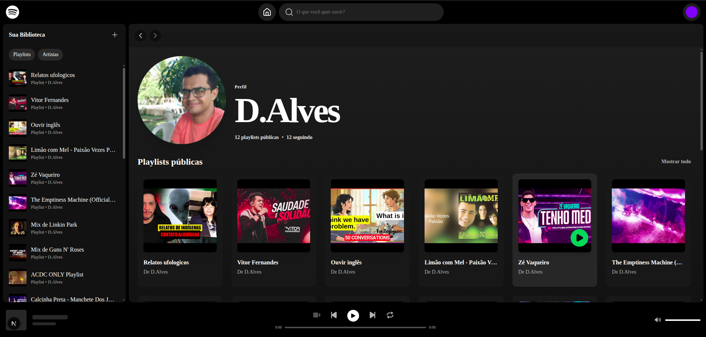
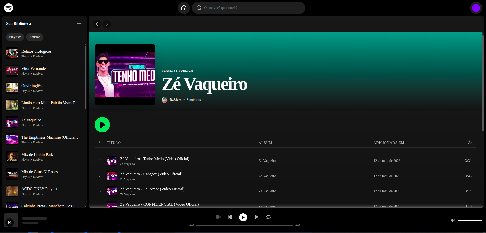
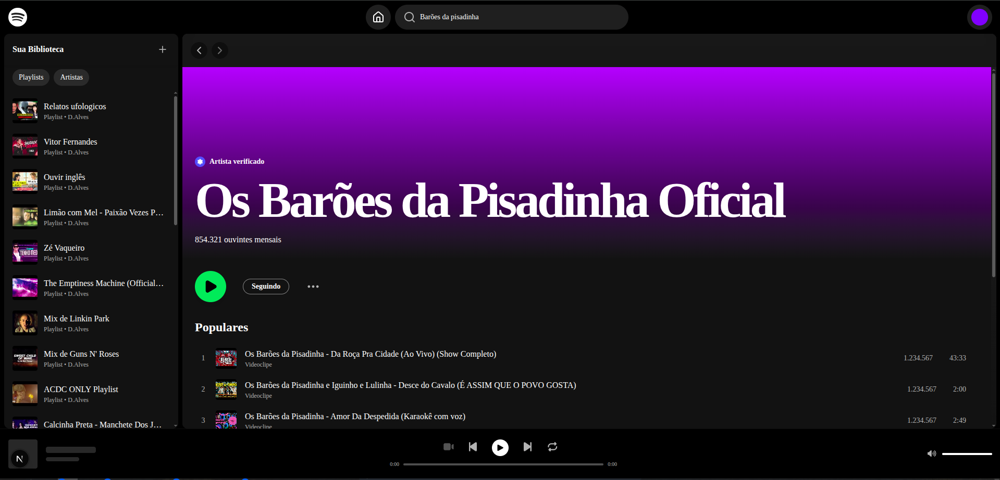
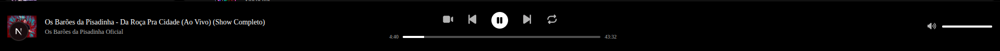
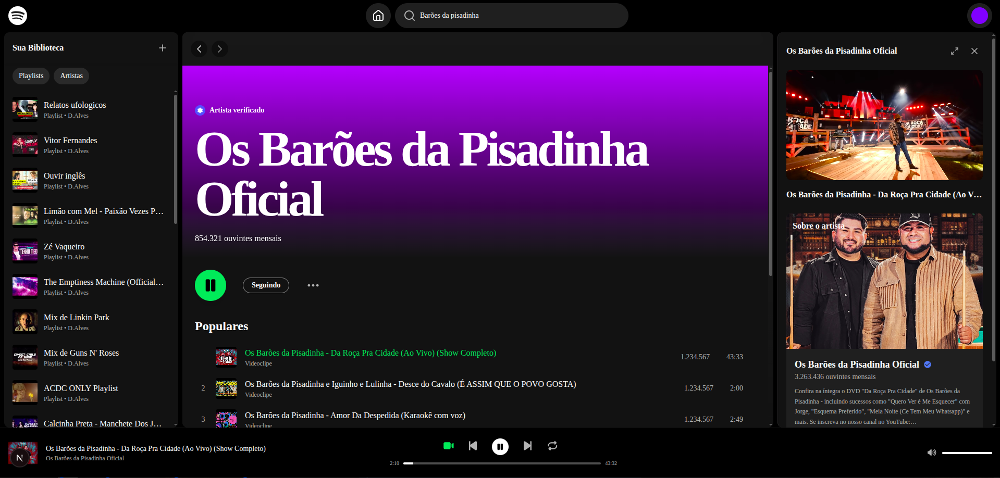
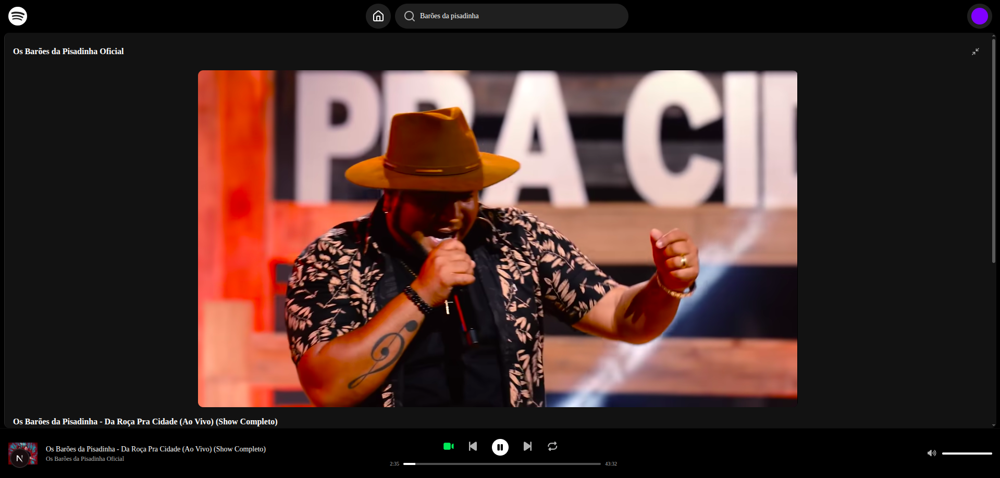
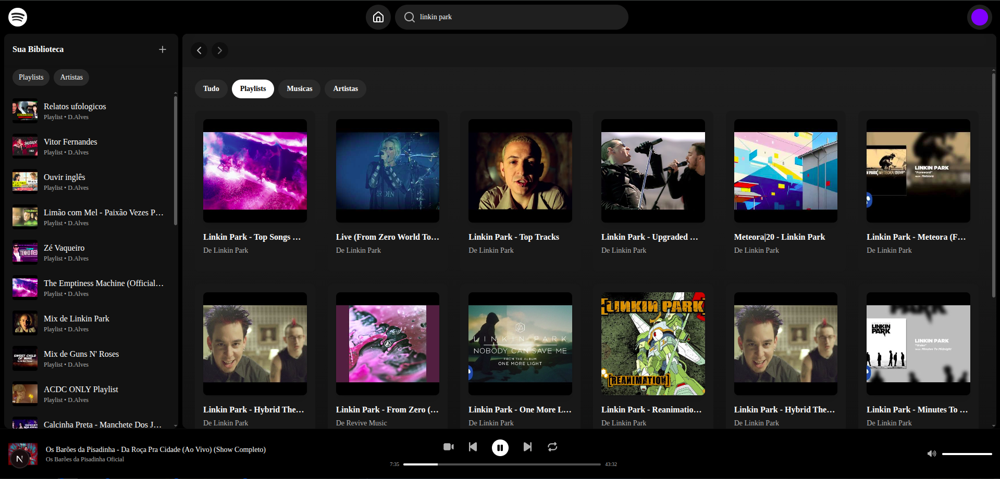

# App Spotify

Web platform for music discovery and playback from YouTube. Authentication via Google OAuth, playlist and subscribed channel sync, embedded player with audio and video support.

## Screenshots

> Below are the main screens of the project and a brief description.

**Login screen** — "Login with Google" button with OAuth authentication.



**Home page** — Highlights, navigation and playlist/artist cards.



**Playlist details** — Track list with dynamic gradient in the header.



**Artist details** — YouTube channel information with dynamic gradient.



**Player** — Fixed bottom bar with playback controls, progress and volume.



**Video sidebar** — YouTube player with video and channel details.




**Music search** — Search field with filter by Playlist, Music and Artists.


## Technologies

| Technology | Version |
|---|---|
| [Next.js](https://nextjs.org/) | 16.2.7 |
| [React](https://react.dev/) | 19.2.4 |
| [TypeScript](https://www.typescriptlang.org/) | 5.x |
| [Tailwind CSS](https://tailwindcss.com/) | 4.x |
| [shadcn/ui](https://ui.shadcn.com/) | Radix Nova |
| [Prisma](https://www.prisma.io/) | 6.19.3 |
| [better-auth](https://www.better-auth.com/) | 1.6.14 |
| [SQLite](https://www.sqlite.org/) | — |
| [YouTube Data API v3](https://developers.google.com/youtube/v3) | — |
| [YouTube IFrame Player API](https://developers.google.com/youtube/iframe_api_reference) | — |
| [FontAwesome](https://fontawesome.com/) | 7.2.0 |
| [Lucide](https://lucide.dev/) | 1.14.0 |

## Architecture

**Single-Page Application (SPA)** built on Next.js **App Router**, using **Server Components** for the root layout and **Client Components** for all interactive logic.

### Navigation flow

```
/                  → Login page (Google OAuth)
/me                → Main application (SPA)
/api/auth/[...all] → better-auth handler (Next.js)
/api/auth/refresh-token → Google token refresh
```

### Pattern

- **Authentication**: better-auth with Google OAuth + automatic token refresh
- **State**: managed locally in the `/me` component via `useState` and `useRef` (no global state)
- **Layers**: API Routes (light backend) → Client Components (UI) → YouTube API (external data)
- **ORM**: Prisma with SQLite for session and account persistence

### Playback flow

1. User logs in with Google (`youtube.readonly` scope)
2. App fetches YouTube playlists and subscriptions
3. On track selection, a YouTube IFrame player is dynamically mounted
4. Controls: play/pause, previous/next, progress, volume, repeat
5. Video can be displayed in a side sidebar or expanded

## Prerequisites

- Node.js 20+
- npm / pnpm / yarn
- Google account with **YouTube Data API v3** enabled
- OAuth 2.0 credentials (Web application) in [Google Cloud Console](https://console.cloud.google.com/)

## How to run

### 1. Clone the repository

```bash
git clone https://github.com/seu-usuario/app-spotify.git
cd app-spotify
```

### 2. Install dependencies

```bash
npm install
```

### 3. Configure environment variables

Copy the example file and fill in your credentials:

```bash
cp .env.example .env
```

```env
BETTER_AUTH_SECRET=<your-secret>
BETTER_AUTH_URL=http://localhost:3000
GOOGLE_CLIENT_ID=<your-client-id>
GOOGLE_CLIENT_SECRET=<your-client-secret>
```

> **BETTER_AUTH_SECRET**: generate with `openssl rand -base64 32`.\
> **Google OAuth**: add `http://localhost:3000/api/auth/callback/google` as an authorized redirect URI.

### 4. Configure the database

```bash
# Sets the SQLite URL
export DATABASE_URL="file:./dev.db"

# Runs migrations
npx prisma migrate dev

# (Optional) Opens Prisma Studio
npx prisma studio
```

### 5. Start the development server

```bash
npm run dev
```

Access [http://localhost:3000](http://localhost:3000).

## Folder structure

```
app-spotify/
├── app/                          # App Router (Next.js)
│   ├── api/auth/                 # API routes (auth, refresh-token)
│   ├── me/page.tsx               # Main page (SPA)
│   ├── globals.css               # Global styles + shadcn theme
│   ├── layout.tsx                # Root layout
│   └── page.tsx                  # Login page
├── components/
│   ├── ui/                       # shadcn/ui base components
│   ├── CardSidebar.tsx           # Playlist sidebar item
│   ├── CardArtistSidebar.tsx     # Artist sidebar item
│   ├── Header.tsx                # Top bar with navigation
│   ├── HeaderSearch.tsx          # Search bar
│   ├── PlayerMusic.tsx           # Fixed player (controls + progress)
│   ├── Sidebar.tsx               # Library (playlists / artists)
│   ├── SidebarVideo.tsx          # Video sidebar with details
│   ├── SpotifyCard.tsx           # Reusable card (playlist/artist)
│   └── login-google.tsx          # OAuth login component
├── lib/
│   ├── auth.ts                   # better-auth configuration
│   ├── auth-client.ts            # better-auth client (browser)
│   ├── db.ts                     # PrismaClient singleton
│   ├── get-youtube-token.ts      # Token refresh utility
│   └── utils.ts                  # Utilities (cn, classnames)
├── prisma/
│   └── schema.prisma             # SQLite schema (User, Session, Account)
├── public/                       # Static assets
└── assets/                       # Images (no_image.jpg)
```

## Contributing

1. Fork the repository and create a branch from `main`
2. Keep conventional commit patterns (`feat:`, `fix:`, `refactor:`)
3. Follow existing code style (ESLint + TypeScript strict)
4. Make sure `npm run lint` reports no errors
5. Open a Pull Request describing the change

## License

MIT
